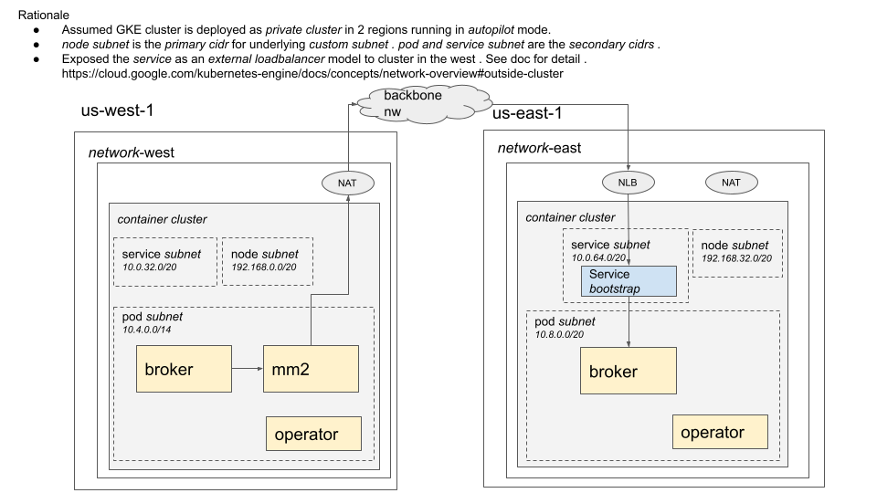

## Overview

This was meant to be a platform for inter-region message mirroring with [Kafka Mirror Maker 2](https://github.com/apache/kafka/blob/trunk/connect/mirror/README.md)   
using [strimzi](https://strimzi.io/) which I helped out on [kafka user mailing list](https://lists.apache.org/thread/bs0cx0gvqc5tq6gv7044g0fb9tosgrg9).
Terraform script will bootstrap _network_ and _container cluster_ resources.

Manifest for strimzi is on separate [repository](https://github.com/yuwtennis/apache-kafka-apps/tree/master/strimzi). 

## Topology



## How tos

### To deploy

Run below command.

```shell
export TF_project=YOUR_PROJECT
terraform apply
```

### To teardown

Note  If _destroy_ stop due to below error, delete _firewall_ from console.

`Error: Error waiting for Deleting Network: The network resource 'projects/xxx/global/networks/nw-green' is already being used by xxx`

Run below command.

```shell
terraform destroy
```